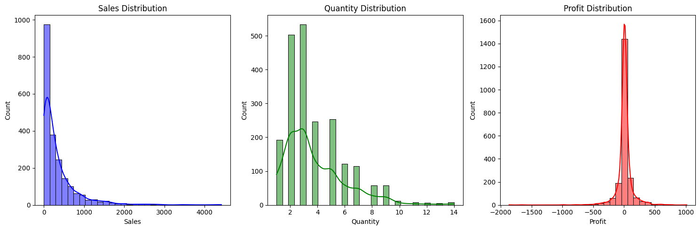
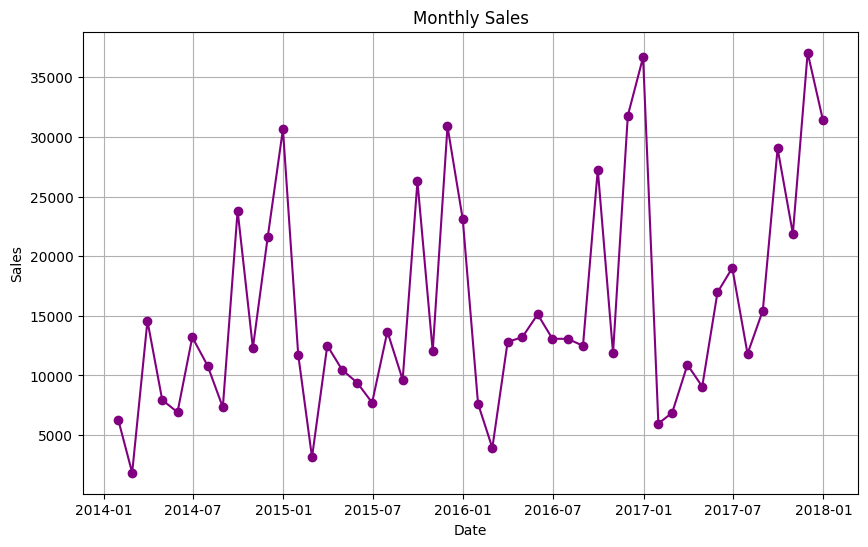
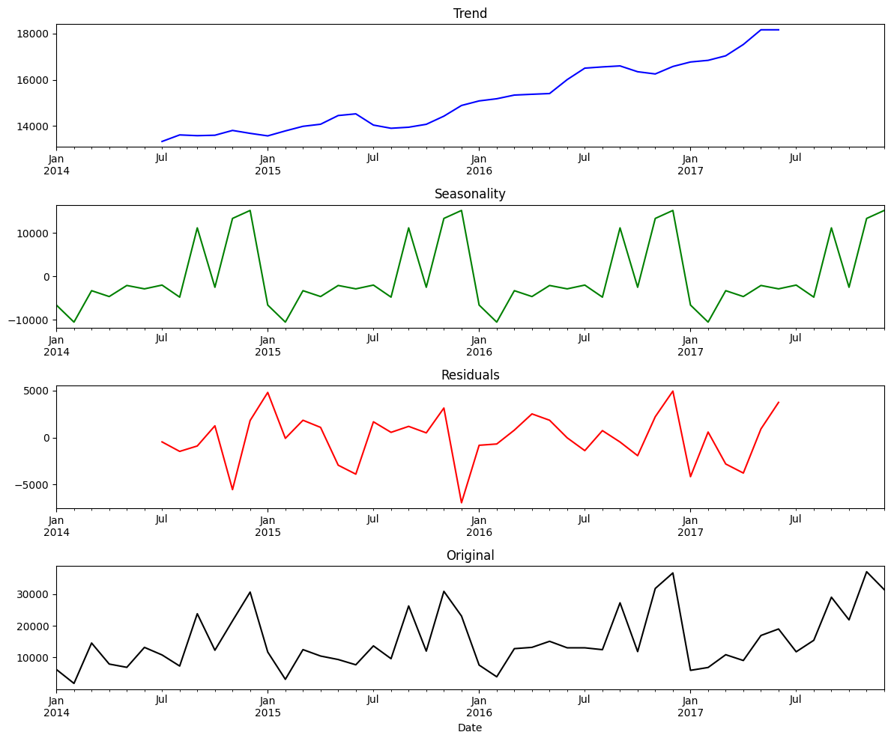
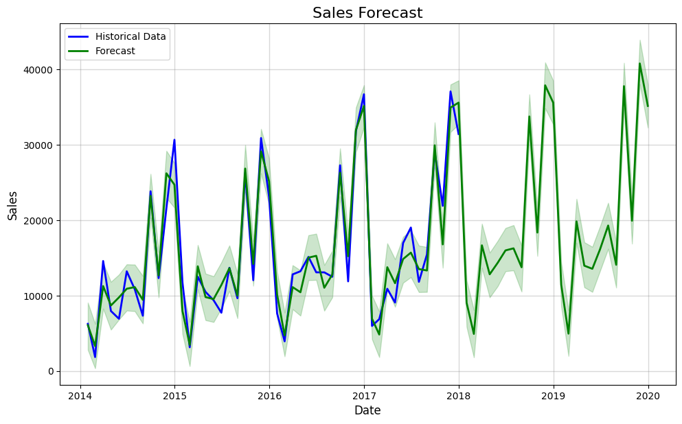
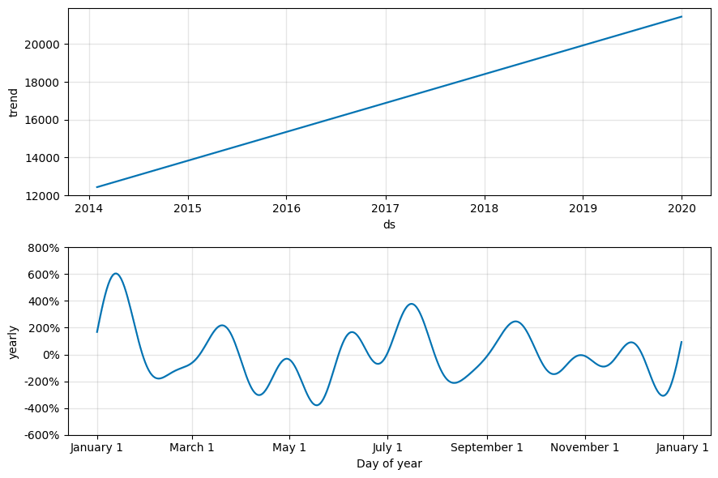

# Store Sales Forecasting using Prophet

This project focuses on forecasting store sales using **Facebook Prophet**, a powerful time series forecasting tool developed by Meta. The dataset used in this project is from [Kaggle](https://www.kaggle.com/code/tanayatipre/store-sales-forecasting-time-series-analysis), where the original analysis was done using ARIMA. In this project, we use **Prophet** to predict future sales based on historical data.

---

## Table of Contents
1. [Project Overview](#project-overview)
2. [Dataset](#dataset)
3. [Project Structure](#project-structure)
4. [Installation](#installation)
5. [Usage](#usage)
6. [Configuration](#configuration)
7. [Results](#results)
8. [Contributing](#contributing)
9. [License](#license)

---

## Project Overview

The goal of this project is to predict future store sales using historical sales data. The project includes the following steps:
1. **Data Preprocessing**: Load and clean the dataset, handle missing values, and prepare the data for time series analysis.
2. **Exploratory Data Analysis (EDA)**: Visualize sales, quantity, and profit distributions, and analyze monthly sales trends.
3. **Seasonal Decomposition**: Decompose the time series into trend, seasonality, and residuals to understand underlying patterns.
4. **Sales Forecasting**: Use **Facebook Prophet** to forecast future sales and visualize the results.
5. **Model Evaluation**: Evaluate the model's performance using metrics like MAE (Mean Absolute Error) and RMSE (Root Mean Squared Error).

---

## Dataset

The dataset used in this project is from [Kaggle](https://www.kaggle.com/code/tanayatipre/store-sales-forecasting-time-series-analysis). It contains historical sales data for a retail store, including the following columns:
- **Order Date**: The date of the order.
- **Sales**: The total sales for the order.
- **Quantity**: The quantity of items sold.
- **Profit**: The profit generated from the order.

The dataset is stored in the `data/` directory as `stores_sales_forecasting.csv`.

---

## Project Structure

The project is structured as follows:

```
Prophet/
├── data/
│   └── stores_sales_forecasting.csv       # Dataset
├── notebooks/
│   └── analysis.ipynb                     # Jupyter notebook for analysis
├── src/
│   ├── data_preprocessing.py              # Data loading and preprocessing
│   ├── data_visualization.py              # Visualization functions
│   ├── prophet_forecasting.py             # Prophet forecasting implementation
│   ├── seasonal_decomposition.py          # Seasonal decomposition
│   └── utils.py                           # Utility functions
├── config.py                              # Configuration for Prophet
├── requirements.txt                       # Python dependencies
└── README.md                              # Project documentation
```

---

## Installation

To set up the project, follow these steps:

1. **Clone the repository**:
   ```bash
   git clone https://github.com/your-username/Prophet-Sales-Forecasting.git
   cd Prophet-Sales-Forecasting
   ```

2. **Install dependencies**:
   ```bash
   pip install -r requirements.txt
   ```

3. **Run the Jupyter notebook**:
   ```bash
   jupyter notebook notebooks/analysis.ipynb
   ```

---

## Usage

### 1. Data Preprocessing
The `data_preprocessing.py` script loads and preprocesses the dataset. It performs the following tasks:
- Drops columns with unique or single values.
- Converts the `Order Date` column to a datetime format.
- Aggregates sales data into monthly sales.

### 2. Data Visualization
The `data_visualization.py` script provides functions to visualize:
- Sales, quantity, and profit distributions.
- Monthly sales trends.

### 3. Seasonal Decomposition
The `seasonal_decomposition.py` script decomposes the time series into trend, seasonality, and residuals using `statsmodels`.

### 4. Prophet Forecasting
The `prophet_forecasting.py` script implements the Prophet model for sales forecasting. It includes:
- Model initialization and training.
- Future sales prediction.
- Visualization of historical data and forecast.

### 5. Running the Analysis
The `analysis.ipynb` notebook combines all the steps:
- Load and preprocess the data.
- Visualize the data.
- Perform seasonal decomposition.
- Run Prophet forecasting and display results.

---

## Configuration

The `config.py` file contains the configuration for the Prophet model. The default settings are:

```python
PROPHET_CONFIG = {
    'yearly_seasonality': True,       # Enable yearly seasonality
    'weekly_seasonality': False,      # Disable weekly seasonality
    'daily_seasonality': False,       # Disable daily seasonality
    'seasonality_mode': 'multiplicative',  # Seasonality mode
    'forecast_periods': 24            # Number of months to forecast
}
```

You can modify these settings to adjust the model's behavior.

---

## Results

Certainly! Here's the updated **Results** section for your `README.md` file, incorporating the images you provided as the results of your analysis:

---

## Results

### 1. **Sales, Quantity, and Profit Distributions**
The following visualizations show the distributions of **Sales**, **Quantity**, and **Profit** from the dataset:



- **Sales Distribution**: The sales data is right-skewed, indicating that most sales are concentrated in the lower range, with a few high-value outliers.
- **Quantity Distribution**: The quantity of items sold follows a similar pattern, with most orders involving a small number of items.
- **Profit Distribution**: The profit distribution shows both positive and negative values, with most transactions yielding small profits or losses.

---

### 2. **Monthly Sales Trend**
The monthly sales trend shows the total sales over time, aggregated by month:



- The plot reveals a clear upward trend in sales from 2014 to 2017, with some seasonal fluctuations.
- Peaks in sales are observed around mid-year, suggesting potential seasonality in the data.

---

### 3. **Seasonal Decomposition**
The time series is decomposed into **Trend**, **Seasonality**, and **Residuals** to better understand the underlying patterns:



- **Trend**: The trend component shows a steady increase in sales over time, with a slight dip in 2016.
- **Seasonality**: The seasonal component reveals a repeating pattern, with peaks in mid-year and troughs at the beginning and end of the year.
- **Residuals**: The residuals represent the noise in the data after removing the trend and seasonality. They are relatively small, indicating that the model captures most of the variability.

---

### 4. **Sales Forecast with Prophet**
The **Prophet** model is used to forecast future sales. The forecast includes historical data, predicted values, and uncertainty intervals:



- **Historical Data**: The blue line represents the actual sales data from 2014 to 2017.
- **Forecast**: The green line shows the predicted sales for the next 24 months (2018–2020).
- **Uncertainty Intervals**: The shaded green area represents the confidence interval for the forecast, indicating the range within which the actual sales are likely to fall.

---

### 5. **Trend and Seasonality Components**
The following plots show the **Trend** and **Yearly Seasonality** components extracted by the Prophet model:



- **Trend**: The trend component confirms the steady growth in sales over time, with a slight dip in 2016.
- **Yearly Seasonality**: The seasonality plot shows a clear yearly pattern, with sales peaking in the middle of the year (around July) and dropping at the beginning and end of the year.

---

## Contributing

Contributions are welcome! If you'd like to contribute, please follow these steps:
1. Fork the repository.
2. Create a new branch (`git checkout -b feature/YourFeature`).
3. Commit your changes (`git commit -m 'Add some feature'`).
4. Push to the branch (`git push origin feature/YourFeature`).
5. Open a pull request.

---

## License

This project is licensed under the **MIT License**. See the [LICENSE](LICENSE) file for details.

---

## Acknowledgments
- Dataset: [Kaggle Store Sales Forecasting](https://www.kaggle.com/code/tanayatipre/store-sales-forecasting-time-series-analysis)
- Facebook Prophet: [Prophet Documentation](https://facebook.github.io/prophet/)